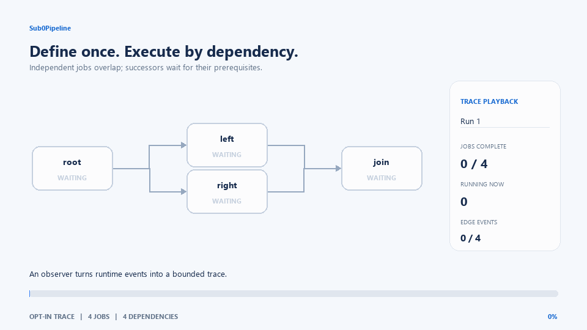

# Sub0Pipeline

A product-agnostic **C++23 DAG job scheduler** with explicit dependencies,
pluggable executors, cancellation and an optional operator DSL. Use it for device
initialization, finite data-processing batches and ordered application work.

Define the graph once, then run it in dependency order. Independent jobs can
execute concurrently when the selected executor supports it. The library uses
`std::expected` for job results and standard C++ ownership/cancellation facilities.
Jobs and observers should not throw across executor callbacks; report job failures
through `std::expected`.

## Feature set

| Capability | Implemented behavior |
|---|---|
| Dependency graphs | Chains, fan-out, fan-in, diamonds and runtime-sized graphs; `succeed()` / `precede()` and `JobGroup` |
| Graph validation and reuse | Cycle validation before the first run and after topology edits; cached roots/validation on unchanged graphs; fresh per-run cancellation state |
| Optional DSL | Separate `dsl.hpp`; `>>`, `+`, `_job`, job groups, tuples and structured bindings |
| Job results | `std::expected<void, PipelineError>`; void jobs are wrapped as successful jobs |
| Failure propagation | Required failures skip successors; optional ordinary failures allow them to continue; cancellation and rejected submissions remain fatal |
| Cancellation | Per-job `cancel()` and external stop tokens for `run`, `runInline` and `runUntil`; queued plain jobs are also suppressible |
| Timeouts | Native helpers or an injected deadline service with caller-owned registrations; expiry reports `kTimeout`; owned plain workers require reaping |
| Structured completion | Opt-in `RunScope` requests stop and joins executor callbacks, deadline callbacks and orphan workers before teardown |
| Completion and reuse | `run()` waits for executor callbacks; `joinOrphans()` waits for timed-out helper jobs; subsequent runs reap old work; concurrent/reentrant runs return `kBusy` |
| Executors | Inline/headless, desktop thread-per-job, priority worker pool, scoped adapter, and an ESP32-P4 FreeRTOS source adapter |
| Job hints | Names, status text, timeout, priority, core affinity and stack size; platform hints depend on the executor |
| Observation and diagnostics | Optional identity-aware run/job/dependency events, status/name queries, snapshots, first failure name, error context and caller-selected text DAG output |
| On-demand jobs | `addOnDemand`, `arm`, `trigger`; excluded from normal roots and invoked individually |
| Repeated work | Stop-controlled DAG reruns with `runUntil`; periodic ticks with the separate `TickLoop` |
| Build and validation | CMake targets/install support, optional executor builds, no-exception core configuration, examples, functional/sanitizer suites and opt-in benchmarks |

### The scheduler in motion

The animation is rendered from the opt-in Chrome Trace events produced by the
`trace_capture` example. It shows dependency gating, independent branches running
in parallel, fan-in, and the live job/edge state an observer can capture.



See the [boot and required-failure captures](docs/observability.md#example-captures)
for more example diagrams. These use real scheduler events from simulated job
bodies; playback speed does not represent measured scheduler performance.

**Not current guarantees:** allocation-free execution, custom graph allocators,
ISR-safe scheduling, hard real-time deadlines, forced interruption of arbitrary
I/O, work stealing, distributed jobs, or automatic idempotency of external writes.
Runtime trace storage, serialization and visualization are caller-owned; no
recorder or trace dependency is installed in the scheduler. Bounded Qt/Zephyr
examples and injected deadline services are available; hardware validation and
fixed-capacity execution remain separate work. See
[embedded and cancellation design notes](docs/structured-cancellation.md).

## Remaining work

- A custom executor that runs each job from inside `dispatch()` nests one call
  per dependency link, so stack use grows with the longest chain. Override
  `IExecutor::runsInline()` to return true, as `runInline()` and
  `SequentialExecutor` do, and the pipeline calls ready jobs from a loop instead.
- [Issue #4](https://github.com/CraigHutchinson/Sub0Pipeline/issues/4) tracks
  measured, explicit bounded-allocation profiles. The current implementation
  retains some reusable scratch but still uses dynamic allocation; it does not
  promise heap-free execution or a caller-selected total memory budget.
- `TickLoop::run(std::stop_token)` returns after the current tick pass;
  callbacks in that pass are not interrupted, and the platform yield may delay
  return by one interval.
- The optional observer supports identity-aware job/run events and one batched
  dependency callback per completed node with successors. Static graph output
  uses `dumpText(std::ostream&)`; bounded capture and Chrome Trace export are
  demonstrated in [trace_capture](examples/trace_capture/main.cpp). See the
  [observability guide](docs/observability.md) for capture, transport and
  embedded-use guidance.

## Quick start

```cpp
#include "sub0pipeline/sub0pipeline.hpp"
using namespace sub0pipeline;

Pipeline pipe;
auto decode = pipe.emplace([] { /* decode a device record */ });
auto validate = pipe.emplace([] { /* validate decoded fields */ });
auto commit = pipe.emplace([]() -> std::expected<void, PipelineError> {
    // Persist the validated record. Return unexpected(...) on failure.
    return {};
});
validate.succeed(decode);
commit.succeed(validate);

auto result = pipe.runInline();
```

Choose an executor explicitly for parallel work:

```cpp
PriorityExecutor executor{{.threadCount = 2}}; // two workers; queue is dynamically sized
// Keep the executor, pipeline and anything borrowed by jobs alive through joining.
auto result = pipe.run(executor);
pipe.joinOrphans();
```

To bound queued jobs, append a startup capacity:

```cpp
PriorityExecutor bounded{{.threadCount = 2, .queueCapacity = 32}};
auto result = pipe.run(bounded);
```

The bound excludes running bodies and completion callbacks. Queue storage is
reserved before workers start. A full queue rejects without retaining or invoking
either callback; it reports a hard error through `SUB0PIPELINE_EXCEPTIONS` (throws
with the default policy, terminates with the no-exception hard-error policy).
Callable argument storage may still allocate. The default capacity of zero keeps
the existing dynamic queue. Worker count must fit `int`; queued plus worker counts
must fit `uint32_t`.

`IExecutor::dispatch` exceptions mean no work was accepted. `run()` converts a
root or successor rejection to `kJobFailed`, skips unstarted work, and joins every
accepted body and completion before returning; an optional job cannot suppress
submission failure. Already-running bodies may finish normally, and concurrent
submissions already in progress may still be accepted. The graph can then run
again. `trigger()` returns `kJobFailed` on rejection and leaves the job retryable
with status `kFailed`, without observer callbacks for rejected work. These joins
provide ownership safety, without a time bound if an accepted body never returns.
Timed non-cooperative helpers still require `joinOrphans()`.

### Optional DSL

```cpp
#include "sub0pipeline/dsl.hpp"
using namespace sub0pipeline;
using namespace sub0pipeline::dsl;

Pipeline pipe;
pipe >> "load"_job([] {})
    >> ("parse"_job([] {}) + "check"_job([] {}))
    >> "commit"_job([] {});
// load -> {parse, check} -> commit
```

Use `JobSpec`, `JobSpecGroup`, `JobTuple`, `JobTupleChain` and `JobGroup` to compose
larger graphs. See the [DSL example](examples/dsl_operators/main.cpp) for supported
composition and structured-binding patterns. The DSL adds no separate scheduler;
it builds the same graph as the core API.

## Cancellation, deadlines and lifetimes

```cpp
std::stop_source shutdown;
Pipeline pipe;
auto transfer = pipe.emplace([](std::stop_token stop)
    -> std::expected<void, PipelineError> {
    if (stop.stop_requested())
        return std::unexpected(PipelineError::kCancelled);
    // Use stop-aware transport waits for real blocking I/O.
    return {};
});
auto result = pipe.runInline(shutdown.get_token());
pipe.joinOrphans(); // before destroying anything borrowed by a timed-out job
```

An external request reaches executing cooperative jobs through their token.
Pending jobs check cancellation before body entry, even without a token
parameter. A request racing with entry may arrive after the body has started.
Per-job cancellation before a run resets during initialization; requests during
the run survive until the job is reached.

`run()` returning and **all borrowed state being safe to release are distinct**
when non-cooperative jobs time out. `hasPendingOrphans()` reports unreaped work,
including threads being joined; it is not a replacement for synchronization.
`joinOrphans()` can block indefinitely if a job never returns. The next run joins
old timed-out work before reinitializing. Untimed inline jobs stay on the calling
thread; timeout enforcement can create native helper threads even inline.

Owner teardown must request stop, join its run thread, then join orphans **before
borrowed members are destroyed**. Destroying a Pipeline concurrently with `run()`
is unsupported. Stop callbacks run synchronously in the requesting thread; they
must not block on the run they are cancelling. Avoid overlapping graph edits,
`arm`, `trigger`, moves or destruction with an active run.

For a device's validate → durable commit → ACK sequence, failed required commit
suppresses ACK. Cancellation can suppress ACK after commit succeeds; the write
is not rolled back. The consumer must supply durable deduplication/idempotent
retry behavior. See the [complete contract](docs/structured-cancellation.md).

## Costs and opt-in behavior

| Path or feature | Selection | Cost / limit |
|---|---|---|
| Core DAG execution | Always | Job state, dependency counters, cancellation checks and run guard. Each run renews the stop state of every job that takes a `std::stop_token` (one allocation each); plain jobs keep theirs until a stop is requested |
| Validation | Automatic on topology change; explicit `validate()` available | Retains reusable graph-sized scratch; validation queries serialize; automatic validation is cached for unchanged repeated runs |
| Failure propagation | Required failure/cancellation/submission rejection | Prepares a graph-sized skip worklist and longest-name diagnostic capacity before dispatch, retains them across runs, and drains callbacks before completion; first preparation can allocate even on success |
| External cancellation forwarding | Supply a stoppable token | One stop callback registration per run; a request then signals every job in the graph. Skipped for the no-token path |
| Observer callbacks and tracing | Supply an `IObserver*` | Absent when no observer is supplied; an attached observer receives concurrent callbacks and pays its own capture/formatting costs |
| Timeout enforcement | Set a finite `.timeout()` | Native helpers by default; injected cooperative deadlines avoid helper threads; plain bodies still use a worker |
| Owned run thread | Construct `RunScope` | One native run thread plus stop state; completion joins callbacks and orphan workers |
| Timeout reaping | A plain timed job exceeds its deadline | Thread tracking and join; empty registry avoids join-lock work |
| Priority worker pool | Construct `PriorityExecutor` with `Options::threadCount` and optional `queueCapacity` | Fixed worker count; zero capacity keeps the dynamic queue; positive capacity reserves queued storage at startup and rejects overflow; callable and platform allocations remain |
| Scoped executor | Construct `ScopedExecutor` over a parent | Local completion accounting; wrapper storage can allocate before submission; rejected submissions roll back the local count |
| Desktop execution | Construct `DesktopExecutor` | One native thread per dispatched job |
| Snapshots / text diagnostics | Call the API | Snapshot allocation or formatting/I/O; not automatic |
| DSL | Include `dsl.hpp` | Compile-time composition; ordinary graph-construction costs still apply |
| Benchmarks | Build option + manual execution/CI | Not part of library execution; expensive timeout samples require `--features` |

Correctness and lifetime guarantees are not disabled to improve benchmark scores.
Fixed/custom storage and interrupt handoff need additional platform contracts;
reserving graph containers alone would not eliminate allocations from callables,
stop states, scratch or executor queues.

The [allocation audit](docs/allocation-audit.md) separates graph construction,
first execution, warmed execution, cancellation, diagnostics and helper costs.
A warmed run of plain jobs makes no C++ allocation calls on the audited MSVC
host; each job that takes a `std::stop_token` still costs one per run. That is a
measurement, not a heap-free guarantee: failure paths, timeouts and executors
allocate, and graph reservation alone cannot make execution heap-free.

See [reusable traversal storage](docs/traversal-storage.md) for the next reduction
in validation/failure allocations and its retained-memory tradeoff.

## Executors and use-case boundaries

The bundled executors are ordinary classes: construct one as a local, a member
or a static, configured through its constructor. To choose at run time, hold
one through `std::unique_ptr<IExecutor>`.

`DefaultExecutor` is an alias for the bundled executor that suits the platform
being built: `FreeRtosExecutor` where FreeRTOS headers are present, otherwise
`PriorityExecutor` where the standard library has threads, otherwise
`SequentialExecutor`. Code that constructs a `DefaultExecutor` and links
`Sub0Pipeline::Default` moves between those platforms unchanged. Zephyr and Qt
have reference adapters under `examples/` but are not yet selectable defaults.

| Executor | Target / location | Behavior |
|---|---|---|
| `DefaultExecutor` | `Sub0Pipeline::Default` | Alias chosen at compile time, as described above |
| `SequentialExecutor` | Header-only, core library | Runs jobs on the calling thread in the order they become ready; constant stack depth; deterministic untimed test scheduling |
| `DesktopExecutor` | `Sub0Pipeline::Desktop` | Thread per job; joins dispatched work; ignores priority/affinity hints |
| `PriorityExecutor` | `Sub0Pipeline::Priority` | Configurable worker count and optional queued-job bound; higher priorities start first; already-running work is not preempted |
| `ScopedExecutor` | Core header | Reuses a parent executor and waits only for locally dispatched jobs |
| `QtExecutor` | `examples/qt_bounded` | Private bounded QThreadPool; caller-runs overflow; no GUI event-loop dependency |
| `ZephyrExecutor` | `examples/zephyr_bounded` | Fixed slots and one Zephyr worker; caller-runs overflow; validated on native simulator |
| `FreeRtosExecutor` | `platform/esp32p4` | ESP-IDF/FreeRTOS source adapter with task priority, affinity and stack hints; host mocks exercise rejection/fallback/completion ownership; physical RTOS execution remains unvalidated |

`ScopedExecutor` supports inner pipelines without waiting for the outer job's
own completion count. It does **not** solve worker starvation: if all workers in
a bounded pool synchronously wait for inner work, no worker remains to run it.
Use inline inner work, reserved capacity or a separate execution resource.

`trigger()` accepts an individual on-demand invocation; observe completion or
wait on the armed executor, then reap timeout jobs. Concurrent submissions need
a thread-safe executor, stable graph and thread-safe job/observer state. There
is no per-invocation future. Duplicate queued/running submissions return `kBusy`;
wait for executor completion before retrying. Each accepted invocation receives
a fresh cancellation state. Foreign handles are rejected.

`runUntil()` reruns a graph until stopped; the caller supplies pacing.
`TickLoop` is a separate class for periodic work after start-up; it shares no
state with a `Pipeline`. `TickLoop::run(stop_token)` returns after the current
tick pass when stopped. Its approximately millisecond host polling (one RTOS
tick on FreeRTOS) is not interruptible, and neither loop is a hard real-time
scheduling guarantee.
Scheduler APIs are **task-context only**. ISR integration should enqueue a bounded
event for later task-context dispatch using platform-proven primitives.

## Build and integration

CMake 3.21+ and a C++23 standard library with `std::expected` are required.

```sh
cmake --preset ci-unix
cmake --build --preset ci-unix
ctest --preset ci-unix --timeout 30
```

Use `ci-msvc` on Windows. The `default` preset also enables benchmarks; the CMake
option itself defaults to OFF.

```cmake
add_subdirectory(Sub0Pipeline)
target_link_libraries(MyDevice PRIVATE Sub0Pipeline::Sub0Pipeline)
# Add Sub0Pipeline::Default for DefaultExecutor, or ::Desktop / ::Priority for
# that executor. SequentialExecutor is header-only and needs nothing more.
```

Installed builds also support `find_package(Sub0Pipeline REQUIRED)`.

| CMake option | Default | Purpose |
|---|---|---|
| `SUB0PIPELINE_BUILD_TESTING` | `ON` | Functional and DSL tests |
| `SUB0PIPELINE_BUILD_EXAMPLES` | `OFF` | Available source examples |
| `SUB0PIPELINE_BUILD_BENCHMARKS` | `OFF` | Nanobench executable; requires test build enabled |
| `SUB0PIPELINE_PLATFORM_DESKTOP` | `ON` | Desktop executor target |
| `SUB0PIPELINE_PLATFORM_PRIORITY` | `ON` | Priority executor target |
| `SUB0PIPELINE_EXCEPTIONS` | `ON` | Library hard-error throwing; OFF supports a core `-fno-exceptions` build |

Tests exercise all host executors and require their targets. A lean consumer
build can disable testing, examples, benchmarks and unused executor targets.
No-exception configuration does not by itself bound memory or make allocation
exhaustion recoverable.

## API map

| Area | Entry points |
|---|---|
| Construct / connect | `emplace`, `reserve`, `succeed`, `precede`, `parallel`, `size` |
| Execute / cancel | `run`, `runInline`, `runUntil`, `Job::cancel` |
| Join / inspect | `joinOrphans`, `hasPendingOrphans`, `status`, `name`, `statusText`, `successors`, `snapshot`, `Job::id` |
| Diagnose | `validate`, `firstFailureName`, `setCurrentJobError`, `dumpText(std::ostream&)` |
| Events / ticks | `addOnDemand`, `arm`, `trigger`; `TickLoop::add`, `TickLoop::run(stop_token)` |
| Job configuration | `name`, `statusText`, `timeout`, `optional`, `priority`, `core`, `stack` |

`"sub0pipeline/sub0pipeline.hpp"` includes the whole core API. Each part can
also be included on its own:

| Header | Provides |
|---|---|
| `pipeline.hpp` | `Pipeline` |
| `job.hpp`, `job_group.hpp` | `Job`, `JobId`, `JobStatus`; `JobGroup`, `parallel` |
| `executors.hpp` | Everything under `executor/`: `executor.hpp` (`IExecutor`), `scoped_executor.hpp`, one header per bundled executor class (`desktop_`, `sequential_`, `priority_`, `freertos_executor.hpp`) and `default_executor.hpp` |
| `observer.hpp`, `dependency_range.hpp` | `IObserver`, `RunId`; `DependencyRange` |
| `error.hpp`, `tick_loop.hpp`, `config.hpp` | `PipelineError`; `TickLoop`, `TickJob`; `SUB0PIPELINE_EXCEPTIONS` |
| `dsl.hpp`, `deadline.hpp`, `run_scope.hpp` | Opt-in layers, not part of the umbrella |

Job statuses distinguish pending, ready, running, done, failed, skipped, timed
out and cancelled. Errors include `kJobFailed`, `kTimeout`, `kCancelled`,
`kCyclicDependency`, `kUnknownJob`, `kNotArmed`, `kNotOnDemand`, `kBusy` and
`kDeadlineUnavailable`. A job skipped because a predecessor failed has status
`kSkipped`; `run()` returns the error of the job that caused it.

`Job::id()` gives the `JobId` that observers receive and that `name(JobId)`,
`statusText(JobId)` and `successors(JobId)` accept. Job handles stay valid when
their `Pipeline` is moved.

`IObserver` provides run, identity-aware job start/finish and dependency
resolution hooks, plus failure details. Existing name-only callbacks remain
supported. With parallel executors, callbacks may overlap and must protect
shared state. A dispatch-start notification does not prove that a cancelled
job body ran. `trace_capture` demonstrates bounded event capture, Chrome Trace
JSON export and display-rate snapshot polling without recording or rendering
inside the scheduler. The no-observer path stores no trace state or events and
does not read a clock. See the [observability contract](docs/observability.md)
and [observer header](include/sub0pipeline/observer.hpp).

## Injected deadlines and owned runs

```cpp
#include "sub0pipeline/deadline.hpp"
#include "sub0pipeline/run_scope.hpp"

// service, executor, graph and borrowed state must outlive the run scope.
pipeline.setDeadlineService(&service); // IDeadlineService, configured while idle
sub0pipeline::RunScope run{pipeline, executor};
run.request_stop();                     // a request, not completion
const auto result = run.join();         // callbacks + timed-out workers joined
```

`IDeadlineService` arms a caller-owned `Deadline` for the job's execution duration.
It can use a platform timer or a manually advanced clock and fixed registration
slots. `cancelAndWait` must unregister and drain expiry callbacks; exhaustion
returns `kDeadlineUnavailable` without running the body. Expire from task context,
because stop callbacks execute synchronously. See [the contract and coverage](docs/structured-cancellation.md).

Cooperative expiry reports `kTimeout` after the body returns, even if the body
ignores its stop token and returns success. It cannot forcibly interrupt arbitrary
I/O. Untimed jobs do not consult the service. Plain timed bodies still require a
native worker; no heap-free or globally threadless execution claim is implied.
`RunScope::complete()` becomes true after joining all owned work; destruction
requests stop and joins. Do not join from jobs or callbacks needed by that run.

## Performance evidence

See [measured baseline/current results](docs/performance.md), including machine,
compiler, source revisions, five alternating process samples, observed ranges
and the costs of optional features. Figures describe no-op host workloads, not
application throughput, worst-case latency or target-device guarantees.

The [performance audit](docs/performance-audit.md) attributes that time with a
profiler and ranks what to optimize next.

```sh
cmake --preset perf-unix          # perf-msvc on Windows
cmake --build --preset perf-unix --target Sub0Pipeline_Bench
./build-perf/tests/Sub0Pipeline_Bench --json results.json --features
```

The benchmark build reuses the vendored nanobench dependency. The capture script
and manually triggered CI workflow retain machine-readable evidence, and
`scripts/profile_vtune.py` profiles one case at a time under Intel VTune. Follow
[CONTRIBUTING.md](CONTRIBUTING.md) for comparisons and regression review.

## Examples, tests and contribution

| Example | Demonstrates |
|---|---|
| [minimal_pipeline](examples/minimal_pipeline/main.cpp) | Linear dependencies |
| [boot_sequence](examples/boot_sequence/main.cpp) | Initialization fan-out/fan-in |
| [parallel_tasks](examples/parallel_tasks/main.cpp) | Desktop parallel workers and aggregation |
| [on_demand_jobs](examples/on_demand_jobs/main.cpp) | Armed event jobs |
| [dsl_operators](examples/dsl_operators/main.cpp) | DSL composition and structured bindings |
| [error_handling](examples/error_handling/main.cpp) | Required/optional failure propagation and `std::expected` jobs |
| [validate_dag](examples/validate_dag/main.cpp) | `validate()`, cycle detection and `dumpText(std::ostream&)` |
| [observer_profiling](examples/observer_profiling/main.cpp) | Custom `IObserver` progress and per-job timing |
| [trace_capture](examples/trace_capture/main.cpp) | Bounded concurrent event capture, Chrome Trace JSON and live snapshot polling |
| [job_options](examples/job_options/main.cpp) | Job builder methods, `precede()`/`succeed()` and optional chains |
| [tick_loop](examples/tick_loop/main.cpp) | Recurring ticks with joinable `std::jthread` shutdown |

The suites include core and DSL regression tests plus optional Qt and Zephyr
adapter executions. Coverage includes
repeat runs, topology-cache invalidation, failure/cancellation edges, queued and
cooperative work, owner teardown, scoped execution and worker completion. Release,
ASan/UBSan and ThreadSanitizer are separate validation configurations; performance
runs use unsanitized Release binaries.

[AGENTS.md](AGENTS.md), [CLAUDE.md](CLAUDE.md), [CONTRIBUTING.md](CONTRIBUTING.md) and the PR template codify
C++23/reuse, product-agnostic wording, ownership, embedded constraints, performance
evidence and documentation gates. Remaining fixed-storage work is tracked in
[issue #4](https://github.com/CraigHutchinson/Sub0Pipeline/issues/4).
