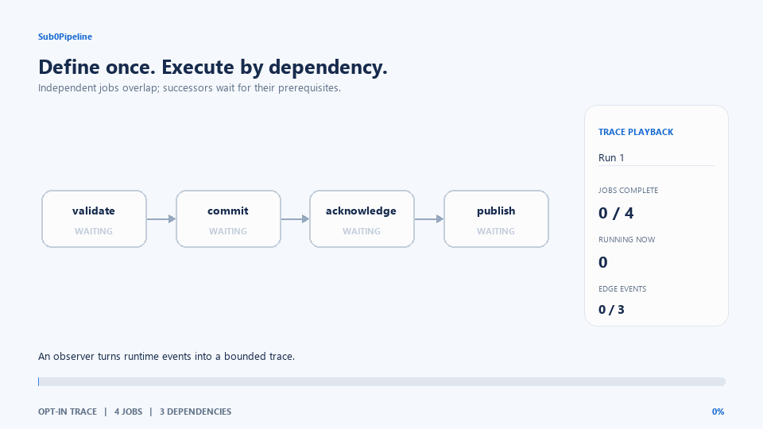

# Observability and trace capture

Sub0Pipeline separates scheduler events from their storage and presentation.
The core does not own a recorder, output stream, transport, file, or UI.

## Opt-in cost

When no observer is attached, no trace event is created or retained and no
timestamp is read. `RunId` acquisition and event dispatch occur only on the
existing observer-enabled path. A caller pays for the recorder, queue, exporter,
transport, or visualization it chooses; these are not default dependencies.

Callbacks run synchronously in the execution context that produces each event.
Parallel executors can invoke them concurrently. Keep callbacks bounded and
protect shared state; do not render a UI, perform blocking I/O, or send network
traffic from worker callbacks. For embedded or latency-sensitive capture, use
caller-owned bounded storage and define overflow behavior. The sample uses a
fixed array and reports drops rather than growing or blocking.
Observer callbacks must not throw or mutate/move the graph. Exceptions from
callbacks are not translated into scheduler errors. Copy borrowed names and
failure messages during the callback if they need to survive it.

## Event identity and meaning

`IObserver::onRunStart()` returns the observer's ID for one run or on-demand
trigger. That ID is passed to the event hooks. `JobId` is the stable,
append-only node index within its Pipeline; names are for display and are not
unique identifiers. Successor edges currently use 16-bit indices, so a
Pipeline accepts at most 65,536 jobs.
The interface is forward-only; prior name-only callback hooks are not retained.

`onJobStart` means dispatch is about to execute the body; it does not guarantee
the body ran if cancellation wins the entry race. `onJobFinish` reports terminal
status, including skipped jobs that never started. `onDependenciesResolved` is
called once after a predecessor's terminal callback with a non-owning range of
all outgoing edges, including edges through which a required failure skips a
successor. `DependencyRange` can also be obtained through
`Pipeline::successors(JobId)` for static topology inspection. Notifications
report outgoing topology; an on-demand trigger does not dispatch successors.
Iterators borrow graph storage directly and survive destruction of the range
wrapper, but graph edits or destruction invalidate them. The batch hook
requires one virtual dispatch per completed node with successors, regardless
of its edge count. All callbacks can overlap across worker threads; there is no
implied global event ordering beyond callback program order on one execution
context.

An observer supplies run IDs so the core needs neither persistent run counters
nor event storage. Observers that need correlation must return IDs unique for
their capture scope. A single observer shared by multiple Pipelines must be
thread-safe and distinguish concurrent runs.

## Offline traces and live status

An observer can copy fixed-size event records into bounded caller-owned storage,
then serialize after `run()` returns and the executor has joined its callbacks.
The `trace_capture` example records job begin/end events and dependency
resolutions, writes Chrome Trace JSON to stdout, and checks live state by polling
`Pipeline::snapshot()` at display cadence. The latter allocates a vector per
snapshot; it is a UI/control-thread facility, not a worker callback.
Live status is written to stderr, leaving stdout as valid trace JSON. Polling
may miss short-lived running states and does not determine execution success.

The README animation is generated from this same Chrome Trace output, so it
shows observed execution rather than a separately timed mock. To regenerate it,
use Python 3.10+ with the optional Pillow documentation dependency:

```sh
cmake -S . -B build -DSUB0PIPELINE_BUILD_EXAMPLES=ON
cmake --build build --config Release --target Sub0Pipeline_TraceCapture
```

Redirect the built example's stdout to a trace file. A single-config generator
typically puts it here:

```sh
./build/examples/trace_capture/Sub0Pipeline_TraceCapture > trace.json
```

For MSVC's multi-config generator, use:

```powershell
build/examples/trace_capture/Release/Sub0Pipeline_TraceCapture.exe > trace.json
```

Then generate the animation:

```sh
python -m pip install -r scripts/requirements-trace-gif.txt
python scripts/render_trace_gif.py trace.json docs/media/sub0pipeline-overview.gif
```

The renderer consumes job IDs, names, start/finish timestamps, status values and
dependency events. It runs offline after capture and has no scheduler/runtime
dependency.

### Example captures

The executable accepts `diamond` (the default), `boot`, or `failure`. These are
real scheduler executions with simulated 40 ms bodies, not device hardware
validation. The GIF stretches each recorded timeline for readable playback;
animation speed is not a throughput or latency measurement. The renderer is
intended for small illustrative DAGs; dense graphs can overlap in its fixed layout.

| Scenario | Experience shown | Expected scheduler result |
|---|---|---|
| `diamond` | Two independent branches overlap, then release a join | Success; four jobs finish |
| `boot` | Storage releases network/display initialization; telemetry and controls gate readiness | Success; six jobs finish |
| `failure` | A required commit fails, suppressing acknowledgement and publication | `kJobFailed`; two descendants are skipped |

All three are checked by CTest when examples and testing are enabled. The
`failure` executable exits successfully only when the expected scheduler error
and complete bounded capture are observed. Edge events report outgoing topology,
including skip propagation; they do not imply a successor body executed.

#### Generic device boot


#### Required-failure propagation



Regenerate the additional diagrams using the same executable and renderer:

```powershell
build/examples/trace_capture/Release/Sub0Pipeline_TraceCapture.exe boot > build/boot-trace.json
build/examples/trace_capture/Release/Sub0Pipeline_TraceCapture.exe failure > build/failure-trace.json
python scripts/render_trace_gif.py build/boot-trace.json docs/media/sub0pipeline-boot.gif
python scripts/render_trace_gif.py build/failure-trace.json docs/media/sub0pipeline-failure.gif
```

For single-config builds, omit `Release/` and the `.exe` suffix. The optional
Pillow dependency is needed only for offline rendering.

`Pipeline::dumpText(std::ostream&)` emits the static graph to a caller-chosen
stream. Static topology and runtime timeline are deliberately separate: the
former is available without running jobs, while the latter exists only when an
observer captures it. The former no-op `dump_trace()` has been removed rather
than pretending a static graph dump contains runtime timing.

## Optional transport and durable capture

Adapters remain outside the scheduler core:

- Sub0Pub can route typed trace records through `Route<T, Transport>`, but its
  send is synchronous. Applications supply any bounded queue, copy/serialization
  policy, overflow handling, and transport. `Accepted` means accepted by that
  transport adapter, not delivered remotely.
- Sub0Log can persist compact records into its file-backed per-process segments
  and merge cooperating processes at read time. This avoids an application-side
  writer queue and is designed to recover committed records after a producer is
  hard-killed. It does not promise power-loss durability. An embedded
  `createInMemory` segment survives only as long as its supplied storage does.

Neither adapter is a default dependency or a hard real-time guarantee. Do not
block scheduler workers on a transport or make scheduler correctness depend on
successful telemetry delivery.
